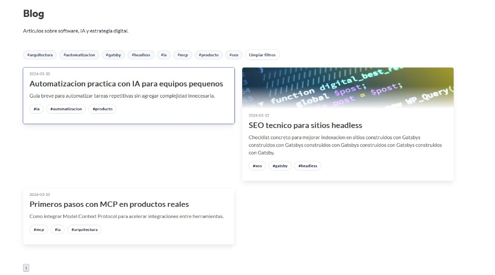

MCP permite conectar modelos con herramientas externas de forma estandarizada.

En Falcode lo usamos para reducir friccion entre APIs internas y asistentes de desarrollo.

## Recomendaciones practicas

- Empieza con casos de uso pequenos.
- Define permisos por herramienta.
- Registra trazas para poder auditar.

